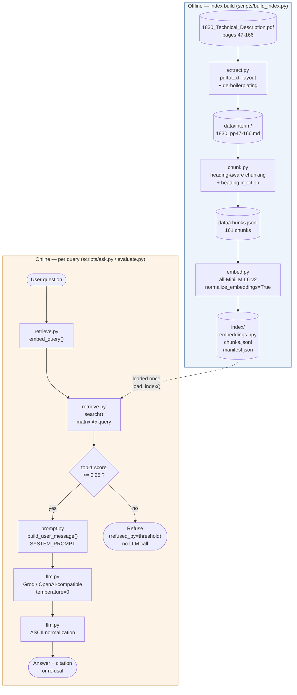
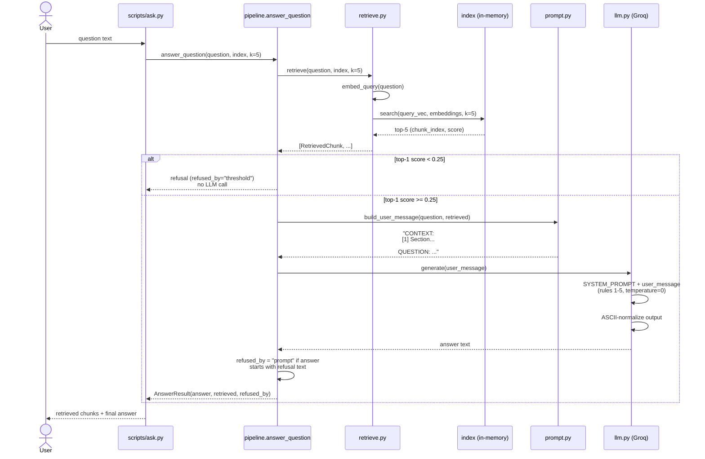
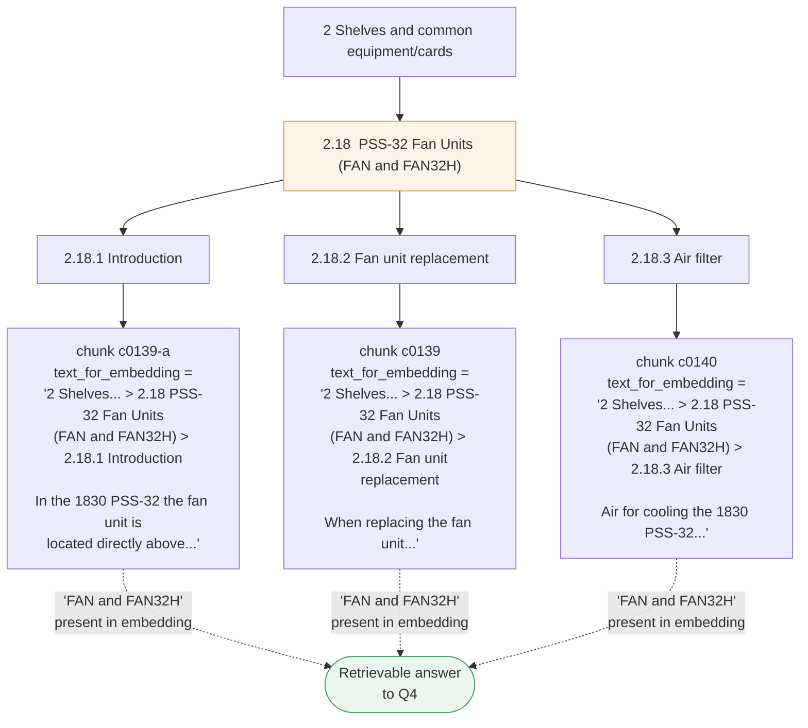

# Architecture & Data Flow

Diagrams render natively on GitHub (Mermaid). Module paths refer to [`src/rag/`](../src/rag).

## 1. System architecture

Two independent pipelines share one persisted index: an **offline** build step that runs once
(or whenever the source pages change), and an **online** query step that runs per question.

**Key property:** retrieval and generation are separate concerns. `retrieve.py` never calls an
LLM; `llm.py` never touches the index. `pipeline.py` (not shown as a box above — it's the glue
that wires GATE → PROMPT → LLM) is the only module that knows about both.

## 2. Data flow — artifact by artifact

What each stage consumes and produces, independent of which script drives it.

```mermaid
flowchart LR
    A[("Source PDF<br/>1568 pages")] -->|"pdftotext -f 47 -l 166 -layout"| B["Raw layout text<br/>(120 pages)"]
    B -->|"strip boilerplate<br/>rejoin hyphen-wraps<br/>protect heading lines"| C[("Clean markdown<br/>&lt;!-- page: N --&gt; markers")]
    C -->|"parse_heading()<br/>build section stack"| D["Leaf sections<br/>(heading path + body tokens)"]
    D -->|"merge sections &lt; 60 words<br/>window sections &gt; 220 words"| E[("chunks.jsonl<br/>161 chunks + metadata")]
    E -->|"text_for_embedding =<br/>section_path + body"| F["all-MiniLM-L6-v2<br/>encode()"]
    F -->|"L2-normalize"| G[("embeddings.npy<br/>(161, 384) float32")]
    G -->|"sha256(chunks.jsonl)"| H[("manifest.json<br/>model, dim, hash")]

    Q(["Question text"]) -->|"same model<br/>encode()"| QV["query vector<br/>(384,)"]
    QV -->|"matrix @ query"| G
    G -->|"top-5 by score"| R["Retrieved chunks<br/>+ scores"]
    R -->|"numbered context block<br/>Section / Page / Path / text"| P["Assembled prompt"]
    P -->|"chat.completions.create<br/>temperature=0"| L["LLM answer"]
    L -->|"ASCII normalize"| Out(["Final answer<br/>with citation, or refusal"])

    style A fill:#f5f5f5
    style C fill:#eef4fb
    style E fill:#eef4fb
    style G fill:#eef4fb
    style H fill:#eef4fb
    style Out fill:#e9f7ef
```

## 3. Query sequence (single question, end to end)

The two refusal paths (`threshold` vs `prompt`) are logged separately in every evaluation record
— see [`eval/results.json`](../eval/results.json) — because they catch different failure modes
(see next section, and [README.md](../README.md#retrieval--prompt-engineering)).

## 4. Why heading injection matters (the core chunking decision)

Three of the eight evaluation questions have their answer **only in a section heading**, never in
a body sentence. Every chunk's embedding text is prefixed with its full ancestor heading path, so
the answer-bearing words propagate to every descendant chunk — not just to a chunk built from the
heading line itself (there usually isn't one; headings aren't chunked separately, they're
prepended to whatever body text follows them).

Without this, only a chunk built from the `2.18` heading line in isolation (which doesn't exist —
headings are attached to the body text that follows them, not chunked on their own) could ever
surface "FAN and FAN32H" to the embedding model. With it, retrieval succeeds regardless of which
specific sub-section (`2.18.1`, `2.18.2`, or `2.18.3`) happens to rank highest for a given query.
